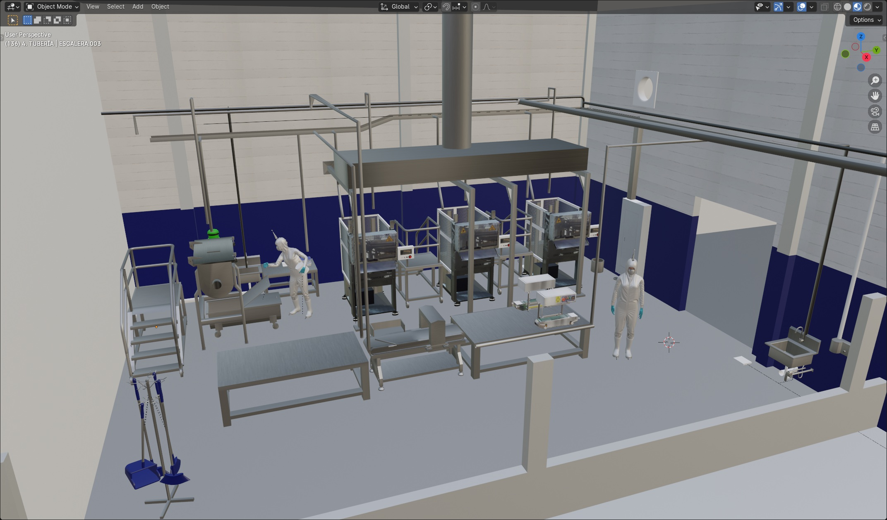

# Mac'Ma

## Proyección 3D de nuevas líneas de producción

Diseñé el espacio virtual de nuevos equipos de producción para su construcción e implementación real. Se presentó la propuesta a Alta Dirección para autorizar la inversión de acondicionamiento del sitio. Gestioné con proveedores la instalación de equipos.

> Cada modelo fue realizado y animado usando **Blender v.4.0**

[Regresar](./)
