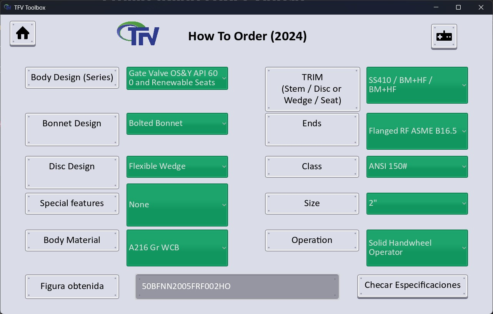
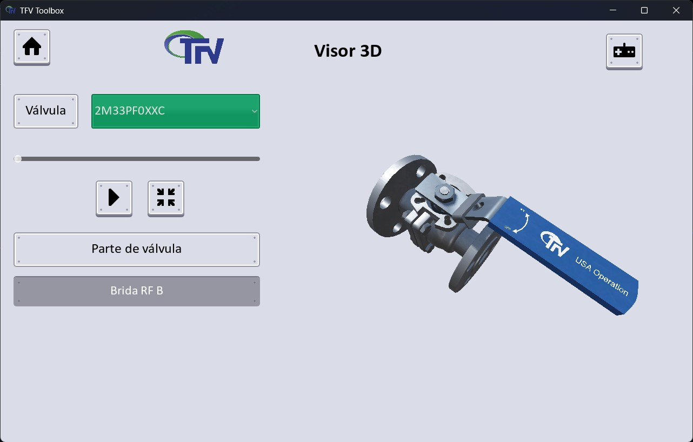
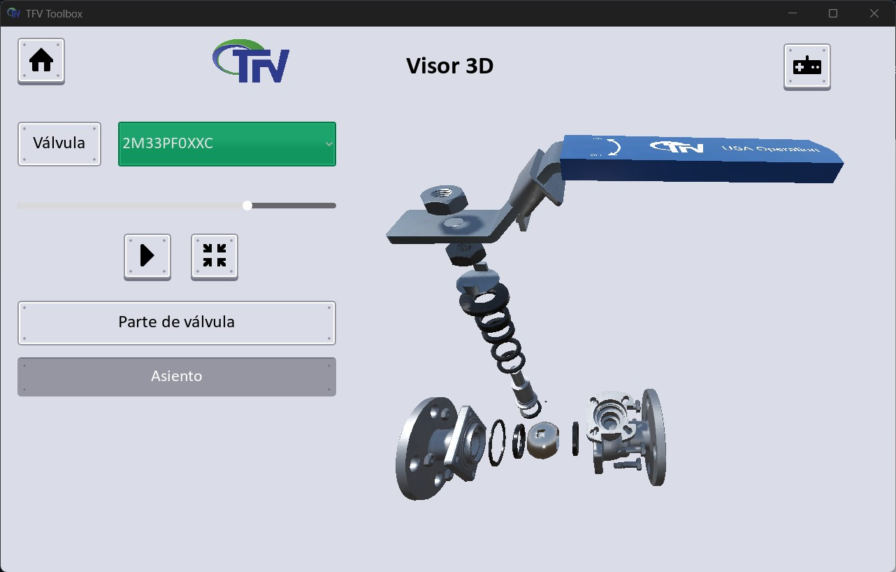

# TFV Operation Mexico

## Programa: TFV Toolbox

Se elaboró un programa que forma la figura de catálogo de una válvula (_How to Order_). Mejorando los tiempos de solicitud de material por parte de cliente, y evitar acudir a consultar cada catálogo por cada tipo válvula a solicitar.

> El programa se desarrolló en su totalidad usando el motor de videojuegos **Godot v.4.4.1**. También se realizó un _visor de válvulas 3D_, en donde se mostraba el desespiece (o explosionado) de cada válvula. Permitiendo desplazar, rotar y escalar el modelo y controlando la animación con una barra para observar con detenimiento la animación. Además, al seleccionar cada parte de la válvula aparece un texto que indica el nombre de dicha pieza. 
> 
> Cada modelo fue realizado y animado usando **Blender v.4.4**

[Regresar](./)
